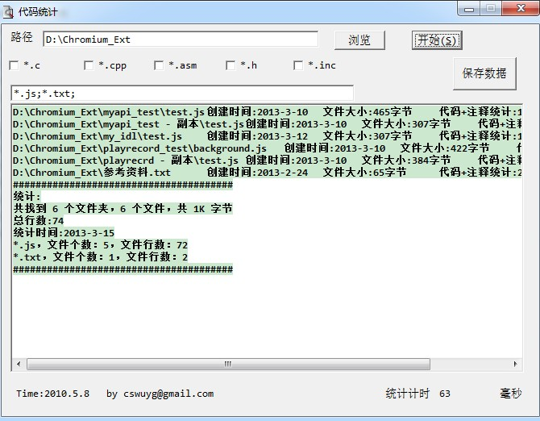

When I was in Junior Hight School I love win32 asm so much,I was powerful,at that time I write some exercises.There is a CodeCount,it counts all lines include the code and annotation.
The Core is :There was a new line by test the byte was '0A'.  
I first write it at May 9,2010 when I was a greenhand,it cost me two days.

在我大三的时候，很喜欢汇编，觉得它很强大。这是我大三的时候花了两天时间于2010年5月9号完成的一个小练习，那时候还有些许bug，昨晚花了4个多小时的时候，重温了win32汇编，再把它的功能完善点，目前它还是可用的。  
下边链接是我当初写完之后发在学校论坛上的，不幸那是一个有bug的版本。
 http://bbs.gdut.edu.cn/ngpxbbs/viewthread.php?tid=261536

how to use:  
1、input the file filter at the second edit,like this:"*.c;*.cpp;*;*.js;"  
2、select the path at the first edit.

I use RadASM to write the code.

cswuyg@gmail.com  
2013.3.15
